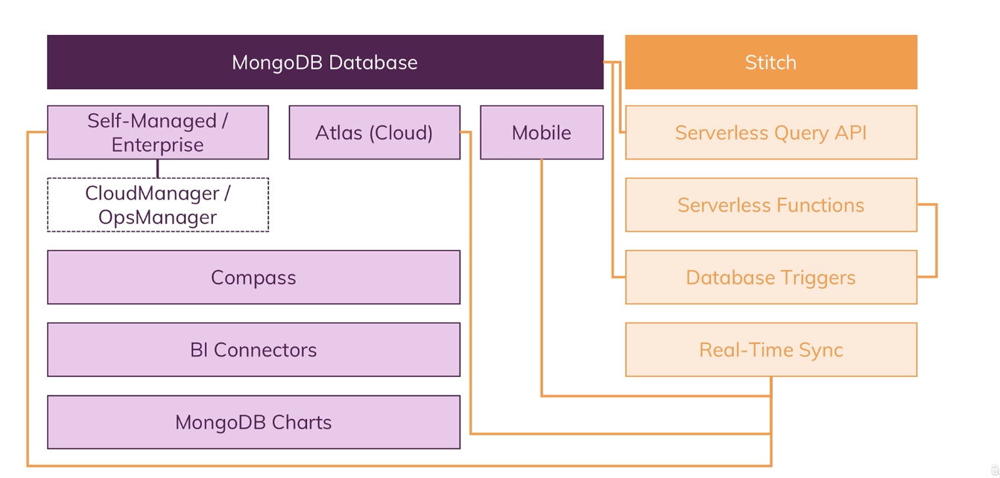
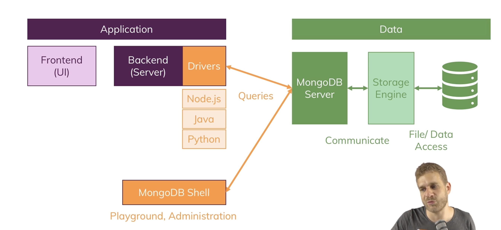
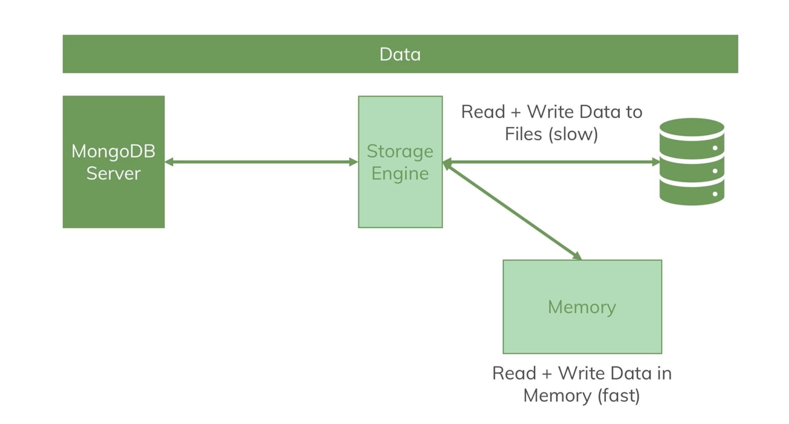

#### What is MongoDb ? 

- Mongodb means humongous (because it can store lots and lots of data)
- Inside a database we have collections
- Inside a collection we have documents 
- These documents are stored in JSON(BSON) data format
- MongoDB converts the JSON data format to BSON(binary version of JSON) which can be stored and querried more efficiently  

#### The Key MongoDB Characteristics (and how they differ from SQL databases)

- MongoDB is a NoSQL database which follows a completely different philosophy than SQL databases .In SQL based databases we normalize the data (Storing data in multiple tables and then use a lot of relations). MongoDB does not force a schema on us
- No/Few Relations , Relational data needs to be merged together (This is where the speed , the flexibility and performance comes from)

#### MongoDB Ecosystem 

#### To run our local mongoDb Server

- To run the mongoDb server run the folowing command at the bin folder of the mongoDB Server `mongod --dbpath /Users/suvadeep/Documents/mongodb/data --logpath /Users/suvadeep/Documents/mongodb/logs/mongo.log`

- Then open a new terminal with `Cmd + N ` and run the following command `mongosh`, The mongosh shell helps us interact with the database
- To test that our server is working properly we can write `show dbs` in the mongosh terminal

#### MongoDB + Clients : The Big Picture

