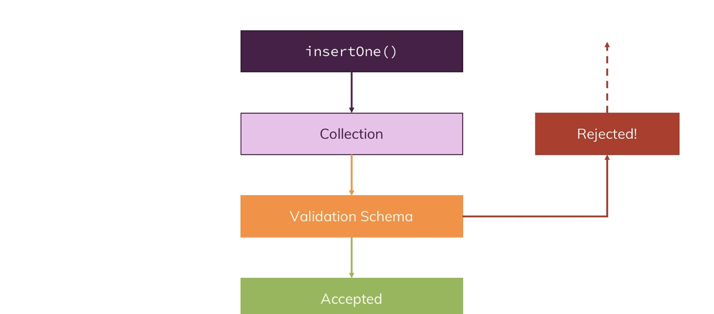

To get rid of a database we can simply load the database we want to get rid of with the `use databaseName` and then execute `db.dropDatabase()`

MongoDB enforces no schemas! Documents dont have to use the same schema inside of one collection . But that doesnt mean that we cant use some kind of schema

#### Data Types 

- Text 
- Boolean 
- Number 
- Integer(int32)
- NumberLong(int64)
- NumberDecimal
- ObjectId
- ISODate
- Timestamp
- Embedded document
- Array

We can have relations using 

1. Nested /Embedded Documents
2. References

#### Nested /Embedded Documents 

- Group data together logically 
- Great for data that belongs together and is not really overlapping with other data 
- Avoid super-deep nesting (100 + levels) or extremely long arrays (16 MB size limit per document)

##### References 

- Split data across collections 
- Great for related but shared data as well as for data which is used in relations and standalone 
- Allows us to overcome nesting and size limits (by creating new documents)

`lookup` in the aggregation framework can help us in merging documents

##### Schema Validation 

we can then set validationLevel like which documents get validated , if for strict mode all inserts and updates are validated , if for moderate mode all inserts and updates to correct documents

We can also set what happens if validation fails like `error` => Throw error and deny insert/update or `warn` => log warning and proceed 